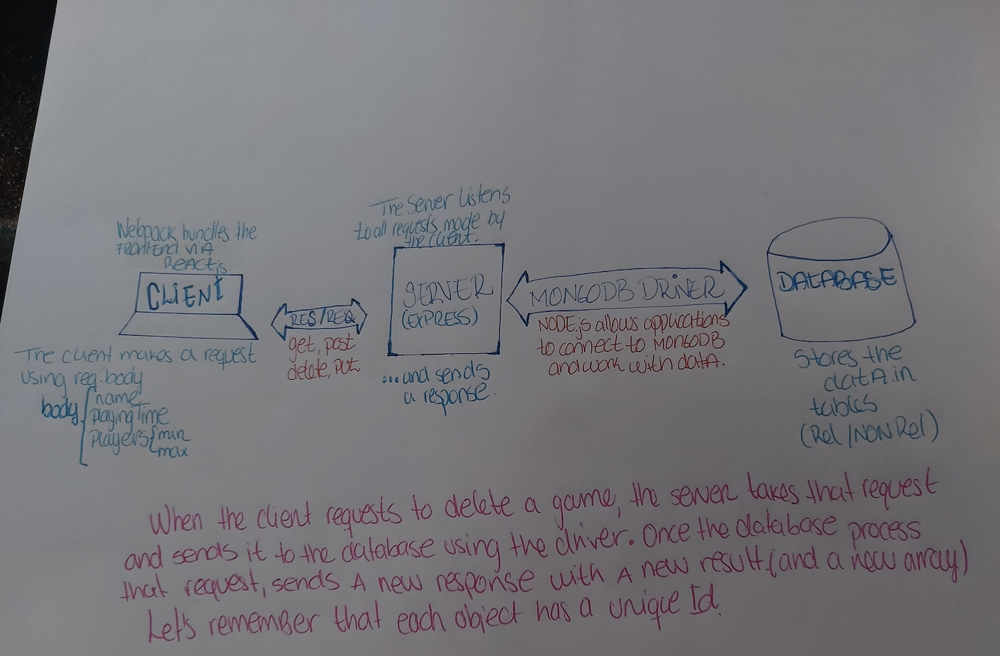

What is responsible for defining the routes of the games resource?
create_router.js

What do you notice about the folder structure? Whats the client responsible for? Whats the server responsible for?
The client is responsible for handling the UI. Also, making requests to the server, such as POST, GET, PUT or DELETE.  The server is responsible of listening, processing and sending results back to the client.

What are the the responsibilities of server.js?
The server listens for incoming requests, reads the data, process it and sends back results or inmediate response.

What are the responsibilities of the gamesRouter?
It holds handlers for the different requests in different paths. It is used to create new routers objects.

What process does the the client (front-end) use to communicate with the server?
HTTP requests - POST, GET, PUT, DELETE

What optional second argument does the fetch method take? And what is it used for in this application? Hint: See Using Fetch on the MDN docs
INIT - which is an object with different options that allows to fetch methods. This applicaitons uses body and mode cors.

Which of the games API routes does the front-end application consume (i.e. make requests to)?
HTTP requests - POST, GET, PUT, DELETE

What are we using the MongoDB Driver for?
To connect to the database and work with the data. (node.js)

Why do we need to use ObjectId from the MongoDB driver?
To identify a document in the database.




<!-- # Games Hub

Games Hub is a full stack JavaScript application with an Express server and MongoDB database.

## Getting Started

These instructions will get the project up and running on your local machine for development purposes.

### Installing

Install dependencies in both the client and the server folders:

```
cd client
npm install

cd server
npm install
```

Seed the database.  Within the server folder:

```
npm run seeds
```

Run express (leave running in a terminal window).  Within the server folder:

```
npm run server:dev
```

Run React environment (leave running in a terminal window).  Within client folder:

```
npm start
```

### Using

The application is running on port 3000 so visit http://localhost:3000/. -->
